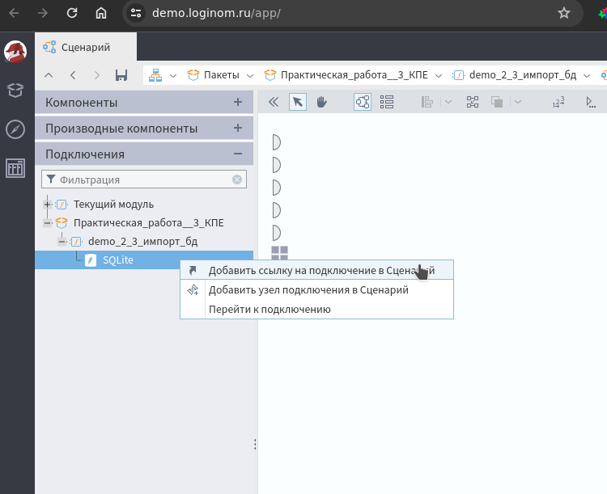
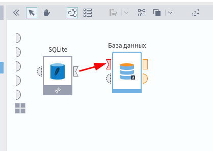
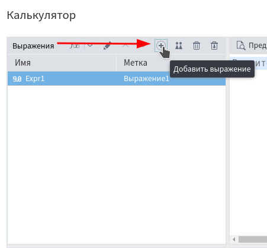
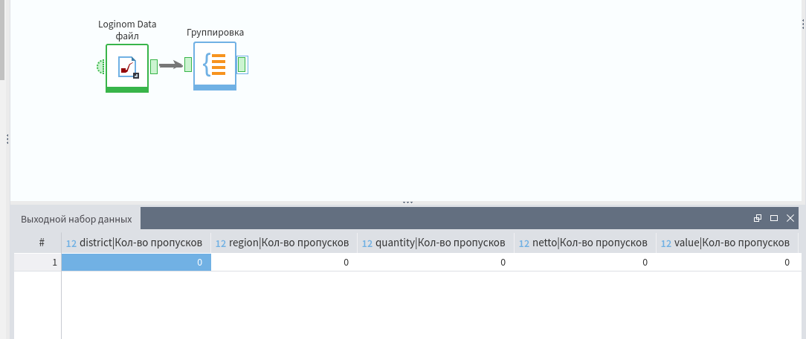

# Обработка данных с использованием Loginom

Использую WEB-версию

## Задание No1. Создание пакета Loginom

1. Создайте пакет

    

2. Название задать при создании (прочто "Практическая работа ..." уже есть, добавил суффикс КПЕ)

    

3. Создайте модуль:

    Для начала надо найти модули в структуре проекта. По структуре проекта можно перемещаться кликая по "пути" (верхняя стрелка на следующем рисунке)

    Если деййствительно создать, но кликать по кнопке "Добавит модуль", но в новом проекте уже есть модуль с названием "Модуль 1" - редактируем его:

    

4. Перенесите на полотно компонент «Loginom Data файл»

    Чтобы попасть на полотно можно в "пути" выбрать название пакета, а затем открыть сценарий в модуле "Демо сценарий"

    

    Для добавления компонента на полотно кликнуть по нему правой кнопкой мыши и выбрать "Добавить узео в сценарий"

    

5. Сохраните пакет.

    Кликаем значок дискеты в верхней панели

## Задание No2. Демо сценарий Loginom

1. Откройте пакет `demo_loginom.lgd`

    Он уже есть на сервере, просто "Пакет - Открыть" и искать по имени

2. Откройте модуль `demo_1_1_тестовый_сценарий`

    

3. Запустите все узлы кнопкой
«выполнить все», убедитесь в том, что
сценарий выполняется без ошибок

    

4. Исследуйте выходные и входные
порты узлов на основе настройки
входных портов и предварительного
просмотра порта данных

    Входные порты слева от узла, выходные справа

    

    Посмотреть и отредактировать можно кликнув правой кнопкой мыши по порту

5. Нажмите на «глаз» под узлом
среднемесячные показатели,
просмотрите визуализацию

    

    Скрин тот же что и в задании, поэтому не привожу

### Контрольные вопросы

* Сколько полей имеет таблица данных на
выходном порте «Импорт добычи газа»?

    14 полей (колонок)

    

* Есть ли пропуски в записях
импортируемой таблицы данных?

    Тыкаем в настройки

    

    И смотрим исходный файл, пропусков в записях (строках) не вижу

    

* Сколько полных записей на верхнем
порте узла «Полные записи»?

    Насколько я понимаю - 28016

    

* Какое поле появилось после выполнения
узла «Начало месяца»?

    "Дата замера (Год + Месяц, Первый день)"

    

* Какие поля добавляются в калькуляторе
«Преобразование полей»?

    Насколько я понимаю смотреть надо на выражения, значит добавляется 4 поля

     

* Сколько записей остается после
агрегации на выходе из узла
«Среднемесячные показатели»?

    `5517`

    

## Задание No3. Импорт из текстовых файлов

1. Откройте пакет с расширением «.lgp»,
созданный вами ранее;

    

2. Создайте новый модуль и измените его
название на «Импорт из текстового файла»

    Как в первом задании

3. Зайдите в сценарий и перенесите из панели компонентов на полотно сценария компонент «текстовый файл»

    

4. Настройте импорт данных из файла
«data\\GAZ\\GAZ_n.csv»:

    

    

    * Кодировка UTF-8;
    * Разделитель табуляция;
    * Пусто – null.

    

    Сразу запиши какие типы у полей, понадобится в контрольных вопросах

5. Убедитесь в корректности импорта
данных воспользовавшись предпросмотром выходного порта

    

### Контрольные вопросы

* Сколько полей (столбцов) получилось в
выходной таблице в результате выполнения
узла?

    `9`

* Какие типы данных имеет каждое поле?

    Тыкаем в настройки (шестерёнка) и смотрим

    * **Дата замера**: _Дата/время_
    * **Ртр МПа**: _вещественный_
    * **Туст С**: _строковый_
    * ... дальше мне лень писать

* Перейдите в настройку форматов
импорта, найдите поле ID и измените его
тип данных на строковый. Сохраните
изменения . Выполните узел.

    

* Как изменился вид данных в поле ID?

    На исходном скрине не видно этой колонки, но скорее всего там был вещественный тип и соответственно добавляло `,00`

* Сколько строк данных получилось в
результате импорта данных из внешнего
файла GAZ_n.csv?

    `28162`

* Каким образом мы настроили чтение
данных из файла `.csv` с разделением
табуляцией?

    Использовали **Узел** текстовый файл и настроили импорт

## Задание No4. Импорт данных из РСУБД

* Создайте новый модуль (`demo_2_3_импорт_бд`) для
данного задания перейдите в него

* Внутри модуля перейдите во
вкладу «Подключения»

    

* Из папки «Базы данных»
перенесите на полотно справа или
ПКМ->Добавить подключение
компонент SQLite

    

* Два раза нажмите на новое
созданное подключение для его
настройки

* В настройках укажите в поле «Имя файла» путь к экземпляру базы данных `Data/SQLite/Chinook.db`

* Нажмите на кнопку «Тестировать» для
проверки корректности соединения с
SQLite

    

* Нажмите на кнопку «Подключить»

    

* Перейдите во вкладку сценарий
* Снизу раскройте «Подключения»

    

* В раскрытых подключениях найдите
свой пакет и данный модуль, где и
будет расположено ваше новое
соединение с базой данных

    

* Нажмите на него правой кнопкой
мыши и выберите опцию «Добавить узел подключения в сценарий»

* Раскройте вкладку «Компоненты»
и перенесите на сценарий
компонент «Импорт - База данных»

    

* Перетащите выходной порт
подключения ко входному порту
базы данных схожего вида.

    

* Активируйте соединение

    Тыкаем "Запустить" **Узел**

    

* Настройте базу данных на импорт
таблицы **Invoice**. Проверьте данные
на выходном порте.

    Активировать оказывается нужно тут

    

    Потом двойной клик по имени таблицы (левая колонка)

* Существует ли возможность быстрого просмотра информации для выходного порта узла подключения к базе данных?

    Нет

* Какое количество записей находится в таблице Invoice?

    `412`

    

* Какую метку имеет поле первичного ключа для таблицы Invoice?

    `InvoiceId`

## Задание No5. Фильтрация пустых полей

* Добавьте модуль `demo_3_1_Фильтрация_данных`

* Для импортированных данных из задания No3 проведите фильтрацию импортированных данных на основе фильтрации записей с пустыми полями

    Добавляем узел "Фильтр строк"

    

* Соедините выход порта узла импорта данных из текстового файла со входом в узел фильтр строк

* Настройте узел фильтр строк для
фильтрации данных

    Тыкаем в `+` и добавляем правила

    

    - При настройке фильтрации данных нажмите на «+» и выберите первое поле после «Номер строки»
    - Задайте для него условие «не пустой»
    - Нажмите применить и повторите действие для всех остальных столбцов
    - Нажмите далее и настройте название метки узла как «полные записи» и нажмите выполнить
    - Для нижнего выходного порта с помощью быстрого просмотра скажите, сколько в нем находится записей

        В нижнем порту, который показывает данные НЕ соответствующие фильтру `146` записей

        

* Сколько строк данных удовлетворяют
условию полных записей?

    Верхний порт: `28016`

* Сколько строк данных не удовлетворяют условию, т.е. содержат пропуски в данных?

    Нижний порт: `146`

* Какой процент от общего количества строк занимают неполные записи?

    Сама сосчитай

* На основе предпросмотра убедитесь,присутствуют ли в выборке неполных записей те, которые имеют пропуски в нескольких полях?

    Маразм

## Задание No6. Сортировка записей

* Для данных, удовлетворяющих условию фильтрации из
предыдущего задания произведите сортировку записей по дате замера (по возрастанию) и скорости добычи газа (по убыванию)

* Перенесите с помощью мыши верхний выходной порт фильтра строк и входной порт сортировки

    Добавляем **Узел** Сортировка

    

* Перейдите в настройку узла сортировки

* Перенесите в настройках сортировки поля «Дата замера» и «газ м3/сут» в поля сортировки

    

* Переключателем настройте порядок сортировки как указано ранее

* Сохраните настройки узла и выполните его в сценарии

* Убедитесь в корректности сортировки данных на основе быстрого просмотра выходного порта сортировки

    

    Дата по возрастанию, при одинкаковой дате объём газа по убыванию

* Какая дата замера оказывается самой ранней в таблице добычи газа?

    `13.10.2014`

* Какой ID скважины соответствует самой ранней записи замеров скорости добычи?

    `1026`

* Изменилось ли количество записей в выходной таблице по итогам сортировки таблицы по сравнению с количеством записей на входе?

    `нет`

* Какая дата замера является самой последней?

    `24.03.2023`

    

## Задание No7. Использование таблицы замен

Необходимо заменить краткие названия месяцев на полные.

* В поле построения сценария добавим 2 компонента импорта: `Loginom data файл` (Исходники) и `Текстовый файл` (Замена).

* Подать на вход набор данных из файлов `Data/Demo/data_months.lgd` и `Data/Demo/ months.txt` соответственно.

    

    >тут нужно выбрать кодировку 1251

    

Таблица исходных данных `Data/Demo/ data_months.lgd` содержит Идентификатор – Краткое название месяца.

Таблица замен `Data/Demo/months.txt` содержит пары значений: `Краткое название
месяца` – `Полное название месяца`.

* Добавим в область построения сценария компонент Замена.

* Подключим наборы данных к соответствующим портам узла и откроем настройку узла Замена.

    

Для полей исходных данных можно настроить Способ замены:
- Не заменять.
- Ввод вручную – формируем внутреннюю таблицу замен.
- Таблица замен – используем внешнюю таблицу замен.

Выберем для поля `Месяц регистрации` способ `Таблица замен`

Назначение поля `Краткое название` установим `Значение`, поля `Полное название` – `Замена`.

Если в исходных данных встретятся значения, для которых не будет совпадений в таблице замен, можно выбрать вариант их замены во вкладке `Заменять остальные`.


На следующем шаге настройки, в окне `Настройка соответствия между столбцами` по умолчанию используется соответствие столбцов `Замена`: столбец с исходными
значениями заменится на столбец с новыми значениями.


Сохраним настройки. Выполним узел. Посмотрим что получилось в результате.

### Контрольные вопросы

* Всем ли записям в выходной таблице данных соответствует значение `true` в поле `Месяц регистрации заменен`?

    нет (только неполные)

* Есть ли во входной таблице данных такие записи, заменять которые было не нужно?

    `Май`

## Задание No8. Вычисление новых полей

В данном задании для упорядоченной выборки
необходимо подкорректировать числовые значения некоторых полей

Для задания с сортировкой данных продолжим построение тестового сценария обработки данных добычи газа

Добавим в область построения сценария компонент калькулятор

* Соединим входной порт калькулятора с выходным портом сортировки из задания No6. Перейдем к настройке узла «Калькулятор»

    

* В поле выражения с помощью кнопки `добавить выражение` добавим новое
вычисляемое поле с именем Temp_tube, и меткой Температура устьевая, цельсий

    

* Запишем для его вычисления следующее условное выражение, которое в поле Tust__S проверяет условие и в случае успешного прохождения производит
деление значения в записи на 10

    ```
    IFF(Tust__S > 100, Tust__S / 10, Tust__S)
    ```

    

    >При написании выражений можно просто два раза кликнуть ЛКМ на нужное входное поле, чтобы оно переместилось в выражение


* Также создадим поля `Pressure_tube` и `Volume_tube` с соответствующими выражениями для их вычисления

    >Данные выражения основаны на анализе предметной области и обзора данных с точки зрения анализа качества выборки

    ```
    IFF(Rtr_MPa > 20, Rtr_MPa / 10, Rtr_MPa)
    ```

    ```
    IFF(gaz_m3_sut < 1000, gaz_m3_sut*1000, gaz_m3_sut)
    ```

    

* Сохраните настройки узла и выполните узел
* С помощью быстрого просмотра выходного порта просмотрите какие поля  получились в итоге

    

    давление пересчитывает, скорость в пределах нормы, а температуру не считает, почему не понимаю

* Сколько новых полей появилось в выходной таблице данных после вычисления выражений в узле калькулятор?

    `3`

* Скопируйте настроенный узел калькулятора, вставьте его в сценарий и подайте на его вход данные из верхнего выходного порта фильтра строк.

    - Выполните данную копию узла.
    - Просмотрите выходную таблицу данных у копии калькулятора.
    - Сравните поля: Скорость добычи газа, м3.сут и газ м3/сут. В какой строчке произошли изменения?

        `9`

        

* Также сравните другие вычисленные поля с их базовыми

## Задание No9. Параметры полей

* Для предыдущего задания добавьте в сценарий обработки данных компонент `параметры полей`, чтобы явно преобразовать структуру данных после проведения расчетов в калькуляторе

* Подайте выходной порт `калькулятора` на входной порт `Параметры полей`

* Настройте параметры полей как показано на слайде, исключив поля, на основе которых проводилось вычисление новых, а также изменив метку для полей конд-т и вода на новые метки

    

* Выполните узел и выполните быстрый просмотр выходного порта из узла «Параметры полей»

    

## Задание No10. Выделение начала месяца

Для созданного сценария в задании No9 добавим компонент `даты и времени` для выделения даты начала месяца добычи газа.

Даты замеров в нашей выборке данных размещены неравномерно, что мешает обрабатывать данные временных рядов. 

* Добавим в сценарий модуля обработки данных компонент «Дата и время»
* Соединим выходной порт «Параметров полей» с входным портом «Дата и время»
* Для поля «Дата замера» выберем разбиение по дате начала Год+месяц

    

* Сохраним настройки узла и выполним его

* На выходном порте узла активируем быстрый просмотр, чтобы убедиться в результате работы компонента

    

## Задание No11. Группировка данных в добыче 

Добавим в сценарий обработки данных расчёт среднемесячных показателей для того, чтобы нормировать временные показатели измерений в одну интервальную шкалу

* Добавим в сценарий из задания No10 компонент «Группировка»
* Соединим выходной порт «Дата и время» с входным портом «Группировка»
* В настройке группировки выберем следующие поля в качестве групп:
    - Дата замера (Год+месяц)
    - ID
    - Куст
    - Группа

    Выберем все числовые поля в качестве показателей и рассчитаем для них среднее

    По-умолчанию для показателей считается сумма, чтобы сменить агрегатную функцию нужно выполнить двойной клик по показателю

    

### Контрольные вопросы

>Почему-то для двух полей среднее не считается - не вывожу их

* Сколько записей мы получили в результате операции группировки данных?

    `5517`

* Какие месяц и год были первыми в списке после группировки?

    `01.10.2014`

* Какие скважины по ID наблюдались в первый месяц в выходной выборке данных?

    1026, 17B, 171, 1013, 1008, 1016, 301, 1019, 1021, 1009, 1015, 161, 1018, 1020, 1011, 1014, 18B, 162, 1023

        

* Какова максимальная скорость добычи конденсата в первый месяц наблюдения? (до 2 знака после запятой)

    Это поле почему-то не считается

## Задание No12. Работа с переменными Loginom

Зададим параметризацию нашего сценария обработки данных добычи газа на месторождениях 

Добавим в сценарий возможность 

* считывать имя файла из входной переменной
* Осуществлять фильтрацию данных по параметру ID скважины
* Задавать ограничения в калькуляторе с помощью переменных

С помощью ПКМ по узлу и выбора опции меню «Показать порт управляющих переменных» для `фильтра строк` создадим у него порт переменных, который сможет принимать входные параметры


С помощью ПКМ по появившемуся порту перейдем в его настройки


После создания новой переменной на входе порта управляющей переменной сохраним все настройки порта и вернемся в область построения сценария Настроим узел «Фильтр строк»

В перечень условий добавим ещё одно условие по совпадению ID скважины со значением из внешней переменной 

Если порт управляющих переменных был настроен корректно, то в значении для сравнения будет успешно добавлен переключатель, позволяющий передавать в данное поле значение из внешней переменной


На выходном порте данных, соответствующих условию
наблюдаем ожидаемую функциональность, что поданное
значение по умолчанию для фильтрации данных отрабатывает в штатном режиме


Далее добавим в сценарий пользовательские переменные, которые можно будет использовать для эффективной параметризации сценария

* На порте переменных пользователя щелкнем ПКМ и
перейдем к настройке порта 

    

* Создадим на порте набор переменных, показанных на слайде

    

* Сохраним настройки

* Соединим порт переменных пользователя с входной
переменной `добычи газа` (я не переименовывал этот узел, у нас он `Текстовый файл`)

* Перейдем к настройке порта входных переменных узла импорта данных

    


## Самостоятельная работа

### Задание 1 (2016)

1. Добавили модуль СР

2. В сценарии добавили узел "Loginom Data File"

    

    В выборке 3710474 строк:

    

    10 столбцов

    Пропусков не нашли ни фильтрацией ни группировкой

    


    Сколько уникальных стран участников торговли перечислено в поле country?

    `239`

    Сколько уникальных регионов России участвовало в торговле (поле region)?

    `82`

### 2018


Строк: 4466172

Столбцов: 10


Уникальных стран: 236

Регионов: 85

количество данных выросло, но качество ухудшилось в связи с увеличением пропусков 


### 3


